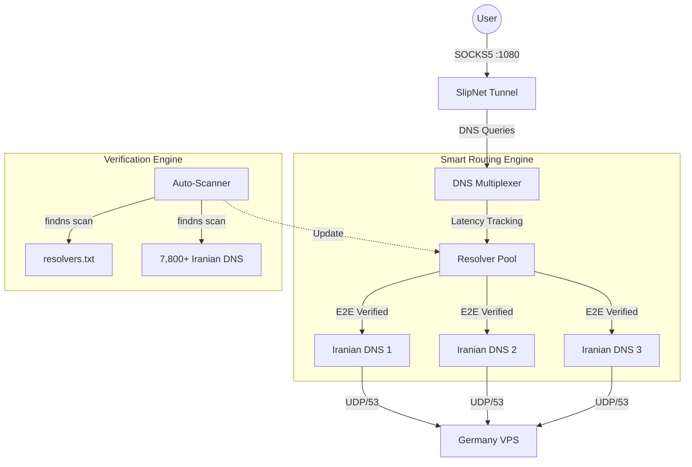

# DNS Multiplexer — High-Performance DNS Tunneling & Proxy

A robust, latency-aware DNS multiplexing service designed to bypass aggressive network censorship (like those in Iran) by intelligently routing traffic through a pool of verified domestic DNS resolvers.

## 🚀 Overview

The DNS Multiplexer acts as a "Smart Bridge" between your restricted network and a remote VPN server (DNSTT/NoizeDNS). Instead of relying on a single DNS resolver that can be easily blocked or throttled, this service constantly scans thousands of Iranian DNS servers to find the fastest, most reliable "holes" in the firewall.

## ✨ Key Features

- **Smart Latency-Based Routing**: Automatically tracks the performance of every DNS query and prioritizes the fastest resolvers in real-time.
- **`findns` Integration**: Uses the professional `findns` engine for **End-to-End (E2E) Verification**. It doesn't just check if a DNS is "up"—it verifies that a SOCKS5 tunnel can actually be established through it.
- **Proactive Auto-Scanning**: Monitors your resolver pool health every 10 seconds. If the number of working resolvers drops, it triggers an emergency scan to find fresh backups before you lose connectivity.
- **Advanced Tunnel Settings**: Full support for Android-style optimizations:
  - **MTU Tuning**: Fragment packets to bypass DPI.
  - **DNS Query Size Mapping**: Limit query length to avoid detection.
  - **Stealth Mode**: Enable advanced obfuscation for NoizeDNS/Sayedns.
- **Hot-Reloading**: Update your `resolvers.txt` on the fly without restarting the service (via SIGHUP or automated file watcher).
- **High-Performance Go Engine**: Replaces the legacy Python proxy with a concurrent, low-memory Go implementation.

## 🏗 Architecture



## 🛠 Installation

The recommended way to install on a fresh Ubuntu server (even during a blackout) is via the `deploy.sh` script.

```bash
# 1. Clone your fork
git clone https://github.com/arielesfahani/DNS-Multiplexer.git
cd DNS-Multiplexer

# 2. Run the deployment (automatic setup)
sudo -E bash deploy.sh \
  --auto --tunnel \
  --profile "slipnet://YOUR_BASE64_PROFILE" \
  --tunnel-mtu 512 \
  --tunnel-query 50 \
  --tunnel-stealth
```

*Note: Use `sudo -E` if you are using a proxy on your laptop to jumpstart the server.*

## 6. Management Commands

The script installs a global `dns-mux` command for easy management:

| Command | Description |
|---------|-------------|
| `dns-mux --status` | Show service health and active settings |
| `dns-mux --logs` | Follow real-time logs (findns activity, etc.) |
| `dns-mux --stats` | Show real-time latency and query stats for all resolvers |
| `dns-mux --restart` | Restart the multiplexer and tunnel |
| `dns-mux --scan` | Manually run a `findns` scan for a specific domain |
| `dns-mux --uninstall` | Completely remove the service and configurations |

## 📁 Configuration

- **Service Logs**: `/var/log/dns-multiplexer/dns-mux.log`
- **Resolvers List**: `/etc/dns-multiplexer/resolvers.txt`
- **Service Config**: `/etc/systemd/system/dns-multiplexer.service`

## ⚖️ License

MIT License. Built with ⚡ by the community for a free and open internet.
